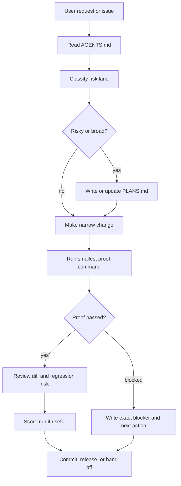

# Workflow Diagram



## Plain-Text Fallback

```text
request
  -> read AGENTS.md
  -> classify risk
  -> write PLANS.md when risk is broad
  -> make the narrow change
  -> run the smallest proof command
  -> review the diff and regression risk
  -> score the run when useful
  -> commit, release, or hand off
```

## Maintainer Rule

The workflow is not complete when code changes. It is complete when the maintainer has evidence, a clear handoff, and an honest statement of what is still unproven.
